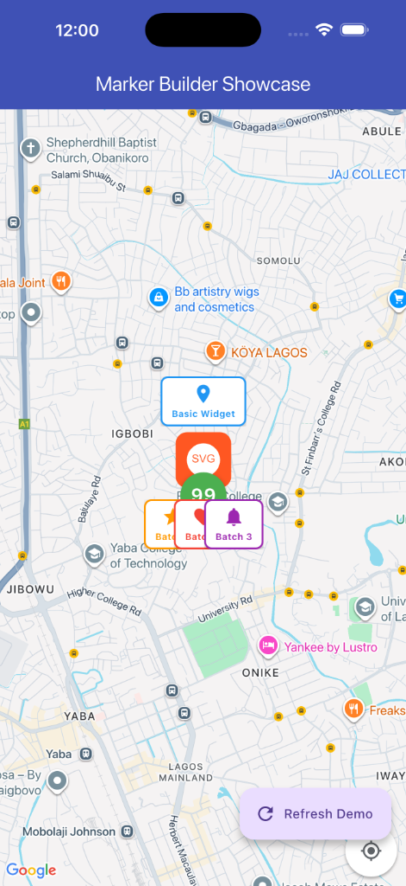

# Custom Map Marker Builder

A high-performance Flutter package for creating dynamic Google Maps markers from standard Flutter widgets. Convert any widget into a marker with advanced caching, batching, and animation support.

## 🚀 Features Comparison

| Feature | 0.0.4 | 1.0.0 |
|---------|-------|-------|
| Widget to Marker | ✅ | ✅ |
| Intelligent Caching | ❌ | ✅ |
| Batch Generation | ❌ | ✅ |
| Network Images | ❌ | ✅ |
| SVG Support | ❌ | ✅ |
| Marker Clustering | ❌ | ✅ |
| Animated Markers | ❌ | ✅ |
| Render Timeouts | ❌ | ✅ |
| Quality Presets | ❌ | ✅ |

## 📸 Showcase



## 📦 Installation

Add to your `pubspec.yaml`:

```yaml
dependencies:
  custom_marker_builder: ^1.0.0
```

## 🛠 Usage

### ⚙️ Global Configuration

```dart
MarkerBuilderConfig.setGlobal(MarkerBuilderConfig(
  defaultQuality: MarkerQuality.high,
  defaultCacheDuration: Duration(hours: 2),
  maxCacheSize: 150,
));
```

### 1. Simple Widget Marker

```dart
final markerIcon = await CustomMapMarkerBuilder.fromWidget(
  context: context,
  marker: MyCustomWidget(),
  cacheKey: "unique_id_123",
);
```

### 2. Batch Processing

```dart
final markers = await BatchMarkerBuilder.fromWidgetBatch(
  context: context,
  markers: [Widget1(), Widget2(), Widget3()],
  onProgress: (completed, total) => print("$completed/$total done"),
);
```

### 3. SVG Support

```dart
final markerIcon = await CustomMapMarkerBuilder.fromSvg(
  context: context,
  svgString: svgString,
  size: Size(40, 40),
);
```

### 4. Network Images

```dart
final markerIcon = await CustomMapMarkerBuilder.fromNetworkImage(
  context: context,
  imageUrl: "https://example.com/marker.png",
  loadingWidget: CircularProgressIndicator(),
);
```

### 5. Animated Markers

```dart
AnimatedMarkerBuilder.fromAnimatedWidget(
  context: context,
  builder: (value) => MyAnimatedWidget(value: value),
  duration: Duration(seconds: 1),
).listen((bitmapDescriptor) {
  // Update your marker icon in the map
});
```

## 📊 Caching System

Built-in caching prevents redundant rendering. You can monitor performance via `MarkerCache.stats`.

```dart
final stats = MarkerCache.stats;
print("Cache hits: ${stats['hits']}, size: ${stats['size']}");
```

## ⚠️ Migration Guide (0.0.4 to 1.0.0)

- `CustomMapMarkerBuilder.fromWidget` now has optional parameters for caching and quality.
- `pixelRatio` is now part of `MarkerQuality` but can still be overridden with `customPixelRatio`.
- All methods now support `renderTimeout`.
- Recommended: Provide a `cacheKey` to take advantage of the new caching system.

## Example

Check the `/example` folder for a complete implementation.

## License

MIT
